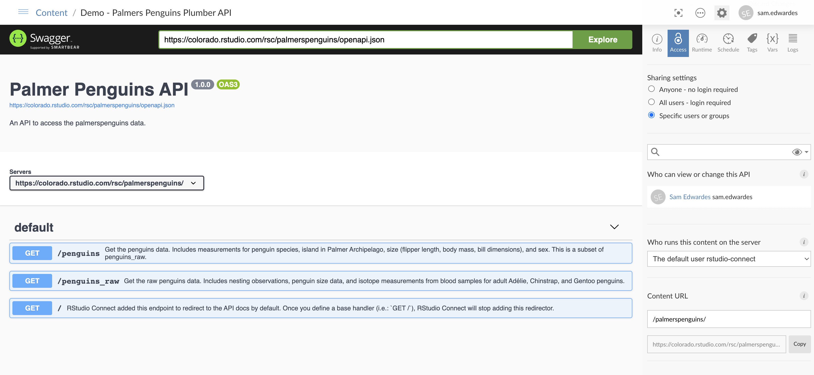

# demo-plumber-penguins

A demo of how to use [Plumber](https://www.rplumber.io/index.html) to create APIs on RStudio Connect.

<https://colorado.rstudio.com/rsc/palmerspenguins/>



## Usage

```bash
curl -X GET "https://colorado.rstudio.com/rsc/palmerspenguins/penguins?sample_size=5"
```
